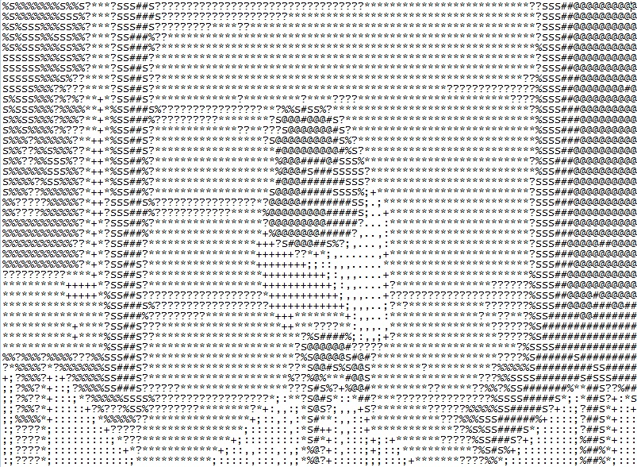

# Photo-to-ASCII-art-in-Python
Turn any image to ASCII character art in Python

# Features:
* To turn images into 100 characters wide ASCII art
* Maintain aspect ratio when converting pixels into text characters
* Save result into 'ascii_image.txt'

